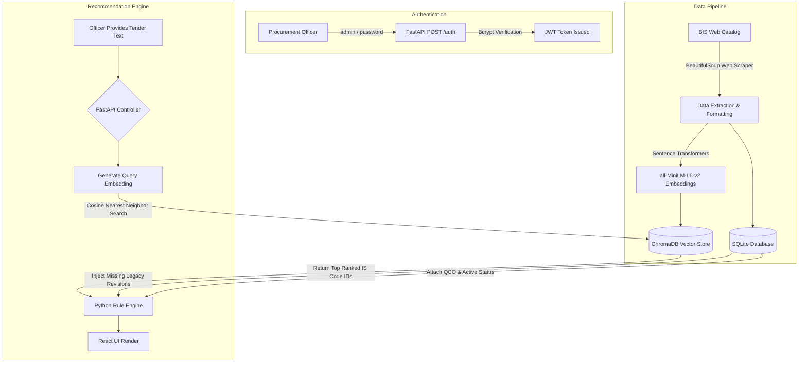

# AI-Powered BIS Recommendation Engine

## What is this project?
This project is an AI-powered Intelligent Standards (IS) recommendation engine designed specifically for the Ministry of Consumer Affairs under the Smart India Hackathon. It empowers government procurement officers to extract precise Indian Standards (IS Codes), Quality Control Orders (QCOs), and normative references directly from plain-text product descriptions or uploaded tender PDFs.

Instead of hunting through legal catalogs manually, officers can provide a description (like "hospital fire doors"), and the engine will instantly recommend the EXACT standard, warn them about mandatory certifications (like ISI checks), and alert them if a standard has been withdrawn or revised.

---

## Tech Stack
Our robust, serverless stack requires zero heavy Docker dependencies and runs beautifully on any local machine.

- **Frontend:** React, Vite, Tailwind CSS, React-Router
- **Backend Core:** FastAPI (Python), Uvicorn 
- **Security:** JWT Authentication (PyJWT, Passlib/Bcrypt)
- **Machine Learning Layer:** `sentence-transformers/all-MiniLM-L6-v2`
- **Vector Database:** ChromaDB (Local Serverless)
- **Relational Structure:** SQLite + SQLAlchemy + Alembic Migrations
- **Testing Suite:** Pytest (Backend) & Vitest + RTL (Frontend)
- **Automated Web Scraping:** BeautifulSoup4, Requests, Python Schedule

---

## Full Architecture Flow



---

## Dry Run Example

1. **Input:** The procurement officer logs into the dashboard and types: *"We are procuring reinforced concrete for highway road construction."*
2. **Translation & Parsing:** The Python backend securely intercepts the request and feeds the contextual text into the local AI embedding model.
3. **Space Matching:** The AI vector theoretically maps the query into ChromaDB, computing distance, and retrieving the geometric nearest ID: `IS 456`.
4. **Relational Logic:** The Rule engine queries SQLite for `IS 456`, actively validating whether there is a mandatory Quality Control Order (QCO) attached or if this code was recently revised.
5. **Output:** The React dashboard dynamically renders **IS 456: Code of Practice for Plain and Reinforced Concrete** with a green `[ ACTIVE ]` pill. Because there isn't a government QCO logged, the compliance badge stays clean, letting the officer print and legally paste the clause into their GeM procurement order. 

---

## How to Run the Project locally 

Because this project abandons heavy Docker-PostgreSQL footprints for serverless SQLite & ChromaDB arrays, launching a local deployment is incredibly fast.

### 1. Start the Secure Backend
Open a terminal and navigate to the backend folder:
```powershell
cd backend

# Install project dependencies
pip install -r requirements.txt

# Run safe database migrations to construct the SQL environment
alembic upgrade head

# Seed the database and generate initial vector embeddings
python seed_data.py

# Boot the API server
python -m uvicorn app.main:app --host 127.0.0.1 --port 8000
```

### 2. Start the Frontend Dashboard
Open a completely new terminal instance and navigate to the frontend folder:
```powershell
cd frontend

# Install UI packages
npm install

# Start the Vite development hot-reload server
npm run dev
```

### 3. Log In
Open your local browser to the printed Vite server endpoint (typically `http://localhost:5173`).
To bypass the JWT security lock, enter the default seeded credentials:
- **Username:** `admin`
- **Password:** `password`
